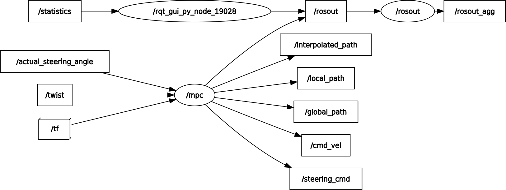

# **MPC local planner**
A nonlinear MPC used to control an autonomous car.
 
## **Description**
---
 
This repository contains an implementation of a nonlinear MPC that is used to control an autonomous car. To do this [ipopt](https://coin-or.github.io/Ipopt/) is used to solve a nonlinear optimization problem. [CppAD](https://coin-or.github.io/CppAD/doc/cppad.htm) is used to interface with ipopt. See this [example](https://www.coin-or.org/CppAD/Doc/ipopt_solve_get_started.cpp.htm) for more information.
The structure of the MPC is inspired by Udacity's [example MPC](https://medium.com/@techreigns/model-predictive-control-implementation-for-autonomous-vehicles-932c81598b49) for their simulator. On top of this there is implemented a ROS interface.
 
<p align="center">
   
   <figcaption align="center">Demo of MPC using gazebo</figcaption>
</p>
 
### **ROS interface**
 
The mpc is made for ROS noetic. All of the inputs to the mpc and outputs are there fore sendt using topics and transforms. The MPC needs to know the state of the car and where the track is. Transforms are used to figure out where the car is. The code looks up the latest transform from a map frame to a car frame. How fast we are going is sent to us as a Twist message on a given topic. It is also required to have a topic where the actual steering angle of the car is published. This is necessary since the car can not turn the wheels infinitely fast.
 
The output of the MPC is a steering angle and acceleration. Currently the acceleration is not used as we set a constant speed. This data is then converted to a twist message using the akerman model to determine what the resulting angular velocity from the steering angle is. In addition to the commands sent to the car several path messages are also published. */global_path* is the reference track. This is where we want the car to drive. This is the green line seen in the gif. */local_path* is where the mpc is planning to drive. This is shown in red. Lastly we have */interpolated_path*. This is a interpolation of the */global_path* using a third order polynomial. The names of all the frames and topics can be found and changed in the file RosMpc.h.
 
<p align="center">
   
   <figcaption align="center">ROS interface for MPC</figcaption>
</p>
 
## **Install**
---

Currently the setup guide is not finished.
There will be an update soon with step by step instructions on how to install the required components.
 
### **ROS**
 
ROS is used to send and receive data. We are using ROS noetic, however other versions could also work. To install ROS noetic use this [link](http://wiki.ros.org/noetic/Installation).

### **ipopt**
 
Ipopt is used as the solver for the optimization problem. Therefore it is necessary to install ipopt. Personally I had some problems doing this. I used this [tutorial](https://coin-or.github.io/Ipopt/INSTALL.html) and ran this [file](https://github.com/uppala75/CarND-MPC-Project/blob/master/install_ipopt.sh) from the Udacity MPC.

### **CppAD**

CppAD has an interface to the ipopt solver that is used in the code. This can be installed by following this [guide](https://coin-or.github.io/CppAD/doc/install.htm). Could also be possible to use the command "sudo apt-get install cppad".

### **Build instructions**

First we need to clone the repository into our source folder in a catkin workspace.

```terminal
cd ~/catkin_ws/src
git clone https://gitlab.stud.idi.ntnu.no/fuelfighter/autonomous/planning-control/mpc-local-planner.git
cd ..
catkin build ##(or catkin_make)
```

We are now ready to run the MPC. This is done by using launch files. Given that all the required topics and frames exist the MPC should start outputting commands.

```terminal
source devel/setup.bash
roslaunch mpc_local_planner mpc.launch
```

## **References**
---

- [ipopt](https://coin-or.github.io/Ipopt/)
- [example mpc](https://medium.com/@techreigns/model-predictive-control-implementation-for-autonomous-vehicles-932c81598b49)
- [CppAD](https://coin-or.github.io/CppAD/doc/cppad.htm)