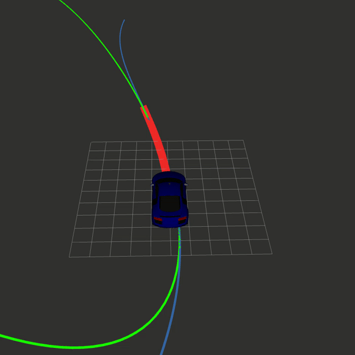
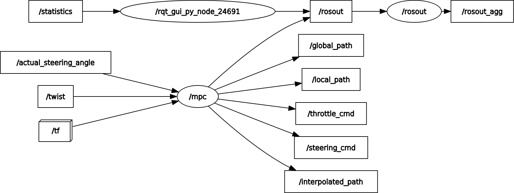

# **MPC local planner**
A nonlinear MPC used to control an autonomous car.

## :book: **Table of Contents**
- [:notebook_with_decorative_cover: **Description**](#description)
  * [**ROS interface**](#ROS_interface)
- [:hammer_and_wrench: **Install**](#install)
- [:rocket: **Usage**](#usage)
  * [**Parameters**](#parameters)
  * [**Run**](#run)
- [:link: **References**](#references)

<!-- <small><i><a href='http://ecotrust-canada.github.io/markdown-toc/'>Table of contents generated with markdown-toc</a></i></small> -->


## :notebook_with_decorative_cover: **Description** <a name="description"></a>
This repository contains an implementation of a nonlinear MPC that is used to control an autonomous car. To do this [ipopt](https://coin-or.github.io/Ipopt/) is used to solve a nonlinear optimization problem. [CppAD](https://coin-or.github.io/CppAD/doc/cppad.htm) is used to interface with ipopt. See this [example](https://www.coin-or.org/CppAD/Doc/ipopt_solve_get_started.cpp.htm) for more information.
The structure of the MPC is inspired by Udacity's [example MPC](https://medium.com/@techreigns/model-predictive-control-implementation-for-autonomous-vehicles-932c81598b49) for their simulator. On top of this there is implemented a ROS interface.

<div align="center">
  
  <br>
  <figcaption align="center">Demo of MPC using gazebo simulator and audibot car</figcaption>
</div>

### **ROS interface** <a name="ROS_interface"></a>
The mpc is made for ROS noetic. All of the inputs to the mpc and outputs are therefore sendt using topics and transforms. The MPC needs to know the state of the car and where the track is. Transforms are used to figure out where the car is. The code looks up the latest transform from a map frame to a car frame. How fast we are going is sent to us as a Twist message on a given topic. It is also required to have a topic where the actual steering angle of the car is published. This is necessary since the car can not turn the wheels infinitely fast. Lastly the MPC needs to know where we want the car to drive. This is sent over the path topic as a path message.

The output of the MPC is a steering angle and acceleration. Currently the acceleration is not used as we set a constant speed. This data is then converted to a twist message using the akerman model to determine what the resulting angular velocity from the steering angle is. In addition to the commands sent to the car several path messages are also published. */global_path* is the reference track. This is where we want the car to drive. This is the green line seen in the gif. */local_path* is where the mpc is planning to drive. This is shown in red. Lastly we have */interpolated_path*. This is a interpolation of the */global_path* using a third order polynomial. The names of all the frames and topics can be found and changed in the file RosMpc.h.
<div align="center">
  
  <br>
  <figcaption align="center">ROS interface for MPC</figcaption>
</div>

## :hammer_and_wrench: **Install** <a name="install"></a>
The MPC requires several things to work. Mainly it is the optimizer ipopt and of course ROS.

1. **ROS**

   ROS is used to send and receive data. It can be installed by following [this]((http://wiki.ros.org/noetic/Installation)) tutorial. If you already have ROS installed you can skip this. ROS noetic is used, however other versions may also work.
 
2. **Clone**
 
   Clone this repository into the src folder in a catkin workspace. Example:

   ```terminal
   cd ~/catkin_ws/src
   git clone https://gitlab.stud.idi.ntnu.no/fuelfighter/autonomous/planning-control/mpc_local_planner.git
   ```
 
3. **Ipopt**
 
   Ipopt is the solver used to solve the optimization problem. First we need to download the source code and dependencies. I recommend doing this in a folder called "c++_libraries" or similar.
 
   ```terminal
   cd ~/c++_libraries #or another folder
   sudo apt-get install gcc g++ gfortran git patch wget pkg-config liblapack-dev libmetis-dev
   sudo apt-get install unzip
   wget https://www.coin-or.org/download/source/Ipopt/Ipopt-3.12.7.zip &&
   unzip Ipopt-3.12.7.zip &&
   rm Ipopt-3.12.7.zip
   ```
 
   We are now ready to build the library. To do this the easiest is to use the file *install_ipopt.sh*. The file does all the building for you. You need to specify where the ipopt folder is located. Example:
 
   ```terminal
   sudo bash install_ipopt.sh ~/c++_libraries/Ipopt-3.12.7
   ```
 
4. **CppAD**
 
   CppAD is used to interface with ipopt. It can be installed by running
 
   ```terminal
   sudo apt-get install cppad
   ```
 
5. **MPC**
 
   Now we are ready to build the mpc. This is done by using catkin build or catkin_make. Example:
 
   ```terminal
   catkin build
   ```
 
## :rocket: **Usage** <a name="usage"></a>

### **Parameters** <a name="parameters"></a>
Once everything is installed and built we are ready to define the parameters for the mpc. This is done using *rosparam*. The parameters are defined in a *.yaml* file in the folder *params*. These parameters need to be correct for your vehicle so that the mpc will work optimally. The parameters can be found and changed in *params/mpc.yaml*. If some critical parameters are not defined the code will not run. It will throw an error telling you what parameter it is missing. Other noncritical parameters cause warnings and some do not even do that. Therefore make sure your parameters are correct. It is not necessary to recompile the code after changing one or more parameters. Simply rerun it as explained in the next section.

### **Run** <a name="run"></a>
Finally we are ready to run the code. This is done by using *launch* files. The main launch file is *mpc.launch*. You can run this file in the following way.
 
```terminal
source devel/setup.bash
roslaunch mpc_local_planner mpc.launch
```
 
You could also specify if you do not want to start rviz by setting the argument rviz:=false.
 
```terminal
roslaunch mpc_local_planner mpc.launch rviz:=false
```
 
It is also possible to only start rviz be using *rviz.launch*. The syntax is the same as for *mpc.launch*.
 
```terminal
roslaunch mpc_local_planner rviz.launch
```
 
## :link: **References** <a name="references"></a>
- [ipopt](https://coin-or.github.io/Ipopt/)
- [example mpc](https://medium.com/@techreigns/model-predictive-control-implementation-for-autonomous-vehicles-932c81598b49)
- [CppAD](https://coin-or.github.io/CppAD/doc/cppad.htm)
